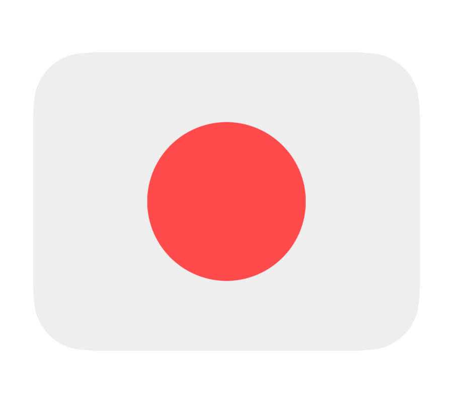
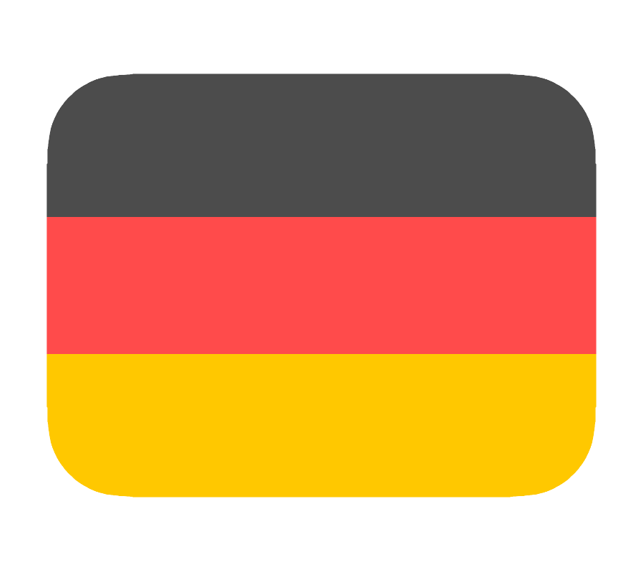
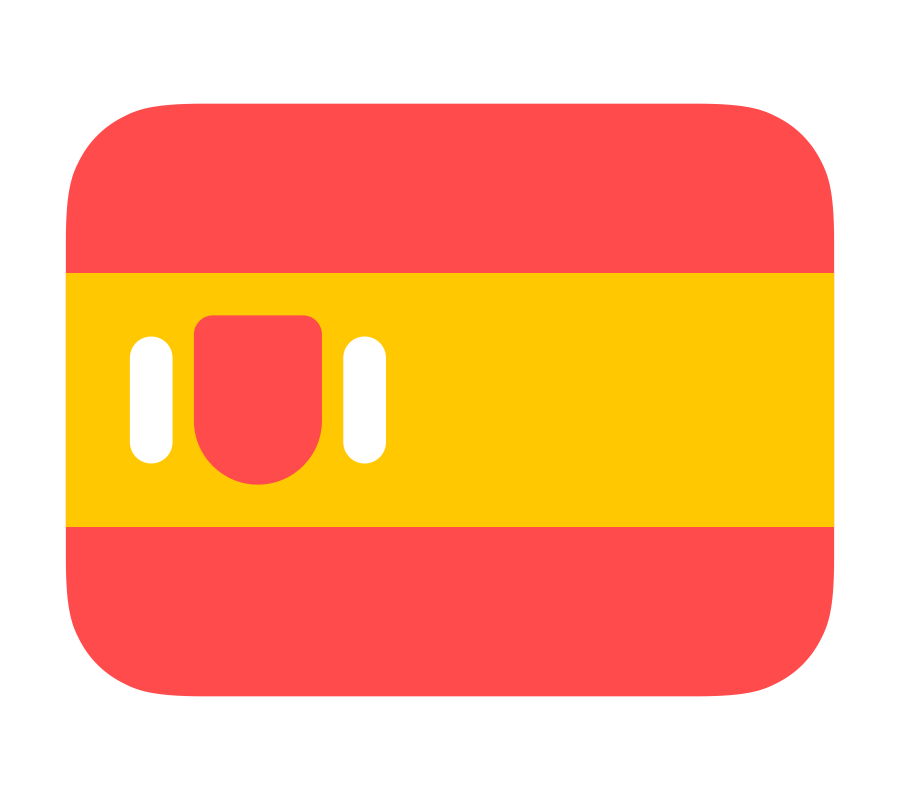

<h1 align="center">Hi 👋, I'm Manas Kolaskar</h1>
<h3 align="center">Future SWE | On a journey through DSA, full-stack, and clean code</h3>

  

- 🌱 I’m currently learning **Full-Stack Development , DSA & Problem Solving AI Engineering**

- 👯 I’m looking to collaborate on ****Open-source full-stack AI tools / agentic projects** (Feel free to DM me if you’re building something cool with AI & TypeScript!)**

- 🤝 I’m looking for help with ****DSA problem solving + CS fundamentals** (I’m actively working on interview prep and improving consistency)**

- 💬 Ask me about **Javascript • React • Next.js •**

  ### My Tech Stack

  

  
  
  
  
  
  
  
  
  
  
  
  
  
  
  
  
  
  
  
  
  
  
  
  
  
  
  
  
  
   
  
  
  
  
  
  
  
  
  
  
  
  
  

### Speaking Languages which i am Learning

  
  
 

###

<h3 align="left">My Stats</h3>

---

  

  

  

---

<h3 align="left">Connect with me:</h3>

