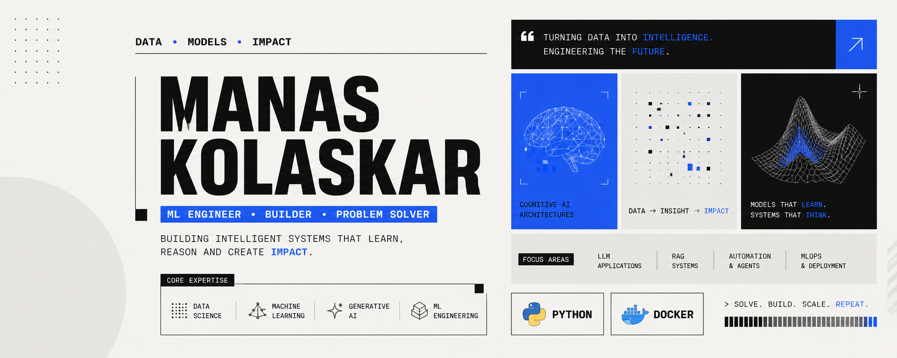
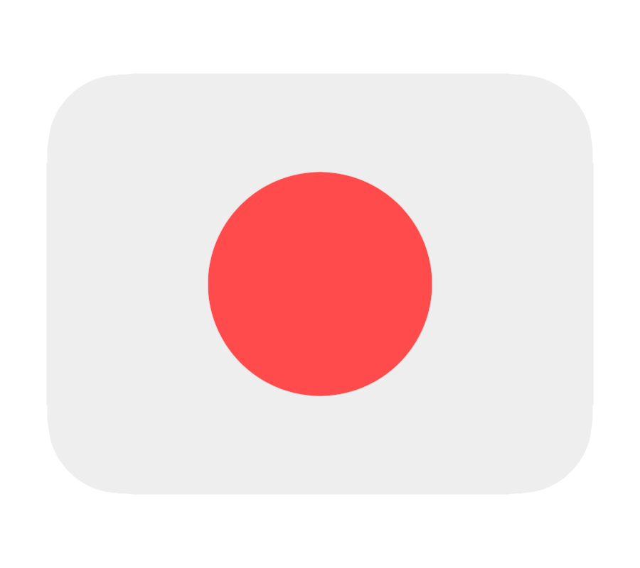
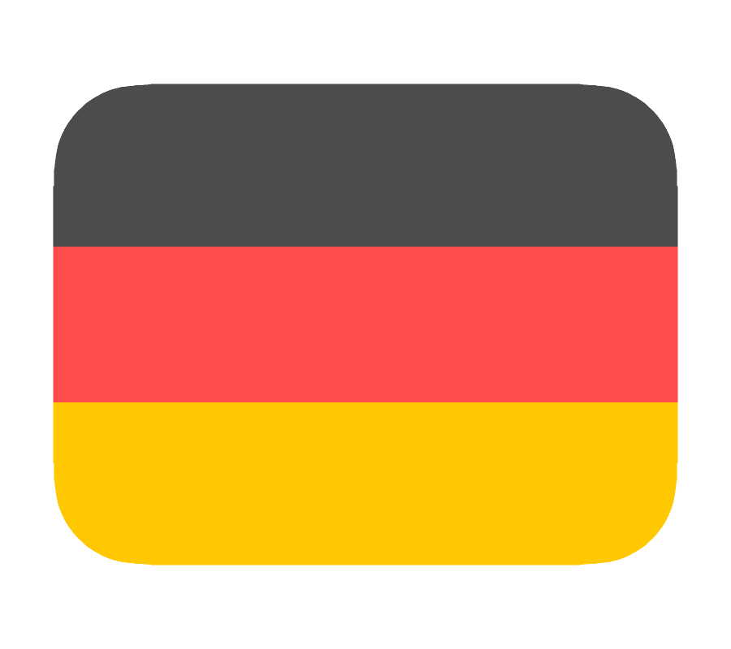
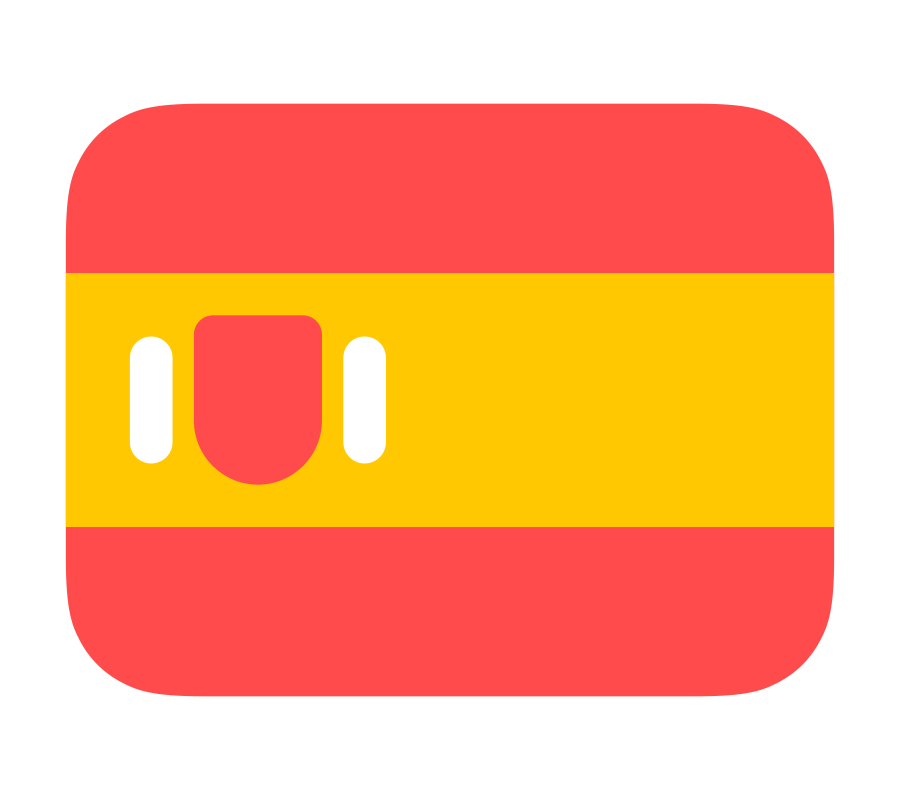

  

<h1> Hey There! 👋 </h1>

I’m Manas, a self-taught AI/ML engineer driven by curiosity and a genuine love for technology. AI is the core of what I want to build in, but my interests also extend into security engineering and IoT, where I’m learning how systems work beyond just intelligence — how they stay reliable, resilient, and secure. I enjoy exploring ideas deeply, connecting concepts across different domains, and constantly pushing myself to learn by building. At heart, I’m just a curious nerd who loves understanding how things work, and my long-term goal is to combine AI and cybersecurity to help create a smarter and more secure digital world.

<h2 align="left">About me</h2>

🧠 Self-taught AI/ML engineer exploring the intersection of AI, cybersecurity, and IoT. 🎯 Goal: to build intelligent, secure systems that make the internet smarter and safer.

<h2 align="left">My Stack</h2>

  <!-- 
 
 
 
 
    -->
 

 
<!-- 

 -->

     

 

### Speaking Languages which i am Learning

  
  
 

  

### Connect with me Here:

  
  
  
  
  

##  📊 GitHub Stats:

  

  

